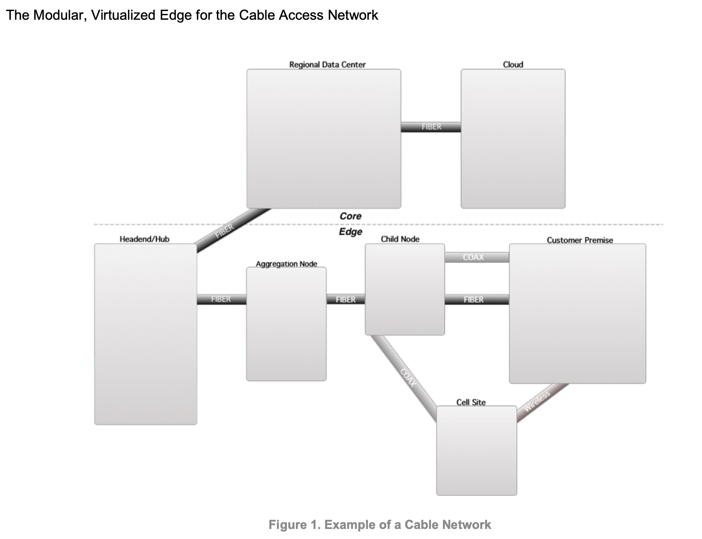

# Cable Sim Assignment

This is an interesting assignment. I appreciated open-ended questions like these and there are a lot of different avenues to take in completing this. 

Given the 2-3 hour time constraint, my first instinct was to breakdown the task into subtasks to effectively manage my time.

1). [Understand the Basics / Define Objectives](#objectives) \
2). [Choose Simulation Tool(s)](#choose-simulation-tools) \
3). [Simulation Environment Setup](#simulation-environment-setup) \
4). [The Prototype](#the-prototype) \
5). [Follow Up Questions](#follow-up-questions) \
6). [Roadmap](#roadmap)

I also immediately had some questions that would be useful in driving the approach:

### Questions
- How far along is vCCAP? Have cable providers adopted this or are the Headend/Hubs still running dedicated traditional Communication Technology hardware?
- Who are the core users of this telemetry monitoring system and how will they be using it?
- What level of the Cable network are they concerned with most?
- How important is data governance?

## Objectives

Gain a basic understanding of how telemetry data is generated, transmitted, and analyzed for Cable networks.

- Determine key metrics
- Identify critical interactions between cable modems and CMTS to simulate to provide meaningful metrics.

**Why are we doing this?** \
_User experience (throughput, latency) depends on end-to-end details and cross-traffic effects. Packet-level simulators like ns-3 are ideal for these studies._

_To reduce the complexity, a single platform to manage the
life cycle of communication and edge workloads and to effectively monitor and share infrastructure to reduce costs would be ideal._

**Example Cable Network** \


### Discovered

Modern cable network design is focused on solving resource allocation problems to maximize throughput and minimize latency. 

Some key metrics include:
- Downstream and Upstream Throughput
- Signal-to-Noise Ratio
- Network Latency
- Packet Loss

**Key Assumption: For the exercise, my plan was to focus on a specific depth of the network. Such as the Headend / Hub.**

### High Level System Design

A log indexing Data Pipeline fed from nodes of a Cable Network might look something like this. The idea of this system design is to be generic, not specific to any one technology. Something to dive into deeper during the review.


## Choose Simulation Tool(s)

Next step is to evaluate the suggested simulation modules including: NS-3, Shadow, and others.

Ultimately, there is a lot of research in this space that I'm not privy to. 
I settled quickly on _shadow_ due to my own personal bias to learn Rust, but also their docs gave the best first impression. 
If this were "real life" decision-making, I'd be more methodical to ensure the tool met requirements and consider Ease of use, Performance, Community support, etc.

The documentation briefly mentions Docker support and an example Dockerfile was in their GHA CI pipelines. These simulation tools take a long time to compile
so while I was waiting for the Shadow build to eventually fail I looked int NS-3 as well.

The impression I got from NS-3 was that this is the industry standard, and _most likely_ fits our use case better. 
To my surprise, [this legend](https://github.com/emanuelegiona/ns3-base-docker) created a useable Docker image yesterday!

## Simulation Environment Setup

_Prerequisites_:
- Docker
- Docker Compose

Docker is faster, more portable, and more lightweight than spinning up a full linux VM which is key for rapid proto-typing.

**To run:**
```bash
# Spin up a dev environment
docker compose up

# Observe fluentbit parsing the logs from the simulation for useful data like latency, ip, port, bytes sent/received.
docker logs cable-sim-fluent-bit-1 
```

## The Prototype

I picked out a few key non-functional requirements from the challenge description:

- On-demand access to subsets of data
- PB Scale
- High availability - shouldn't tax network
- No centralized storage

**Key Assumption: True de-centralized storage, such as a Torrent protocol, is out of scope for this exercise. Instead I went with a _distributed_ system.**

For these requirements, my instinct tells me using a SQL Data Warehouse like: Druid, Snowflake, AWS Redshift, or BigQuery, etc. 
Each of these solutions enables OLAP queries in milliseconds on high-cardinality and high-dimensional data sets with billions to trillions of rows without pre-defining or caching queries in advance. 

For the initial stack - I wanted to spin up Prometheus + Grafana to get some metrics and dashboards quickly as I'm not as familiar with Druid or Snowflake and BigQuery cannot be run from a container.

## Roadmap

- [x] Setup Docker image with Ns-3 to run simulations
- [x] Setup fluentd as a sidecar to run alongside simulation service and provide a lightweight, fast, unified logging layer
- [ ] Prometheus and Grafana for metrics and dashboard 
Incomplete. I cut myself off while setting up the the fluentd parsed logs as Output to a Prometheus Metrics Exporter
- [ ] Run a more complex simulation and understand limits and calculate resource requirements for services
- [ ] Better understand the storage requirements
- [ ] Convert to a container orchestration framework like AWS ECS, Cloudrun, Swarm, or Kubernetes to run system in the cloud
